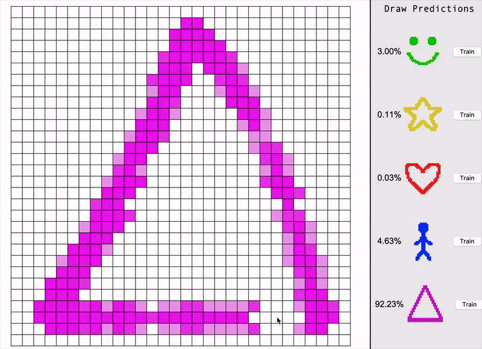
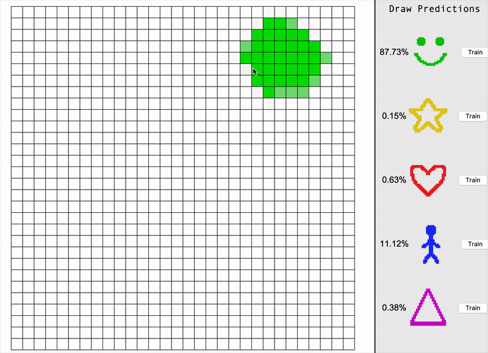

# Cornelius Neural Network | Drawing Recognition

This project demonstrates a **neural network built from scratch in Python** that recognizes user-drawn images in real-time! The neural network is trained to identify 5 simple drawings: 🙂 ⭐️ ❤️ 🧍 △. Once the network recognises your drawing, the canvas will light up according the prediction probability. The various drawings are colour coded according. There are basic tools within the application for drawing, erasing, changing brush size and clearing the canvas.
The model can be trained by the user within the application. Alternatively, the model can be deleted and the user can train the model from scratch.



## How to Run
Download the repository and run:

```python3 app.py```

(Make sure you have Numpy and Tkinter)

## Features
- **Real-time prediction**: Neural network guesses as you draw.
- **Custom Neural Network**: User can directly train and modify the neural netowork.
- **Colour-coded**: Canvas colour matches the network's prediction

## How It Works
1. **Pre-trained Model**: The project includes a pre-trained model stored in trained_model/. You can delete the contents of this directory to train a model from scratch.
2. User Input: Drawings made in the Tkinter window are converted into a 1D array of 900 grayscale pixel values.
3. **Neural Network Structure**: The network has 900 input neurons, two hidden layers with 64 neurons each (ReLU activation), and an output layer with 5 neurons (softmax activation). Loss is calculated using Cross-Entropy.
4. **Training**: Clicking "Train" runs the network, performs backpropagation with a learning rate of 0.01 for manual training, and updates predictions instantly. However, for batch training, a learning rate of 0.001 is used with pre-drawn datasets. A batch can be loaded by pressing 'L'.

## Demo


### Prerequisites
- Python
- NumPy
- Tkinter

### Acknowledgement
The logic and structure of the neural network script was created with the help of an online tutorial series: [NNFS in python](https://www.youtube.com/playlist?list=PLQVvvaa0QuDcjD5BAw2DxE6OF2tius3V3). 